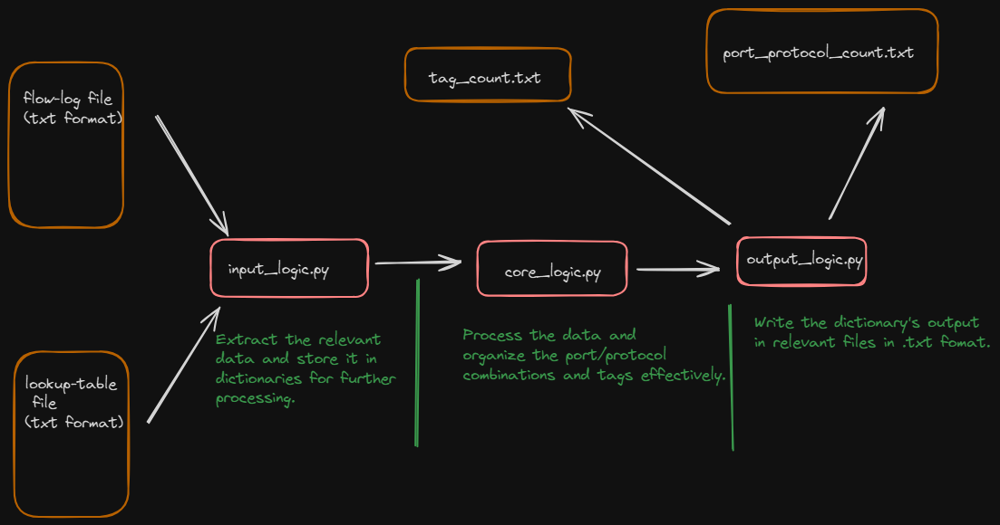

# Summary

Just 24 hours back on Monday (23 September 2024) I got the email from the hiring team regarding the following assesment with the question as follows. Please refer to following sections as to what I have done and how you can check my solution.

**<u>[MOST IMPORTANT] similar assesment that I solved before</u>** -> [click on this github link](https://github.com/sarthak-2000/G-Research)
# Question

<details close>
<summary> Click here to check the question given by the recruting team </summary>


Thank you for your interest in the Engineering position at Illumio. As part of our interview process, we would like to assess your technical skills through a take-home coding exercise.

Please find the details of the exercise below. We ask that you complete the exercise within 48-72 hours, upload it to a GitHub project and share the project link with us. If you need more time, please tell me so I can update the hiring team. This assessment shouldn’t take longer than 2(ish) hours. Feel free to write the code in whatever environment you prefer.

<details oclose>
<summary>Description</summary>

Write a program that can parse a file containing flow log data and maps each row to a tag based on a lookup table. The lookup table is defined as a csv file, and it has 3 columns, dstport,protocol,tag. The dstport and protocol combination decide what tag can be applied.

</details>


<details close>
<summary>Sample flow logs (default logs, version 2 only).</summary>

```2 123456789012 eni-0a1b2c3d 10.0.1.201 198.51.100.2 443 49153 6 25 20000 1620140761 1620140821 ACCEPT OK

2 123456789012 eni-4d3c2b1a 192.168.1.100 203.0.113.101 23 49154 6 15 12000 1620140761 1620140821 REJECT OK

2 123456789012 eni-5e6f7g8h 192.168.1.101 198.51.100.3 25 49155 6 10 8000 1620140761 1620140821 ACCEPT OK

2 123456789012 eni-9h8g7f6e 172.16.0.100 203.0.113.102 110 49156 6 12 9000 1620140761 1620140821 ACCEPT OK

2 123456789012 eni-7i8j9k0l 172.16.0.101 192.0.2.203 993 49157 6 8 5000 1620140761 1620140821 ACCEPT OK

2 123456789012 eni-6m7n8o9p 10.0.2.200 198.51.100.4 143 49158 6 18 14000 1620140761 1620140821 ACCEPT OK

2 123456789012 eni-1a2b3c4d 192.168.0.1 203.0.113.12 1024 80 6 10 5000 1620140661 1620140721 ACCEPT OK

2 123456789012 eni-1a2b3c4d 203.0.113.12 192.168.0.1 80 1024 6 12 6000 1620140661 1620140721 ACCEPT OK

2 123456789012 eni-1a2b3c4d 10.0.1.102 172.217.7.228 1030 443 6 8 4000 1620140661 1620140721 ACCEPT OK

2 123456789012 eni-5f6g7h8i 10.0.2.103 52.26.198.183 56000 23 6 15 7500 1620140661 1620140721 REJECT OK

2 123456789012 eni-9k10l11m 192.168.1.5 51.15.99.115 49321 25 6 20 10000 1620140661 1620140721 ACCEPT OK

2 123456789012 eni-1a2b3c4d 192.168.1.6 87.250.250.242 49152 110 6 5 2500 1620140661 1620140721 ACCEPT OK

2 123456789012 eni-2d2e2f3g 192.168.2.7 77.88.55.80 49153 993 6 7 3500 1620140661 1620140721 ACCEPT OK

2 123456789012 eni-4h5i6j7k 172.16.0.2 192.0.2.146 49154 143 6 9 4500 1620140661 1620140721 ACCEPT OK 
```
</details>


For e.g. the lookup table file can be something like:

dstport,protocol,tag

25,tcp,sv_P1

68,udp,sv_P2

23,tcp,sv_P1

31,udp,SV_P3

443,tcp,sv_P2

22,tcp,sv_P4

3389,tcp,sv_P5

0,icmp,sv_P5

110,tcp,email

993,tcp,email

143,tcp,email

The program should generate an output file containing the following:

Count of matches for each tag, sample o/p shown below

Tag Counts:

Tag,Count

sv_P2,1

sv_P1,2

sv_P4,1

email,3

Untagged,9

Count of matches for each port/protocol combination
Port/Protocol Combination Counts:

Port,Protocol,Count

22,tcp,1

23,tcp,1

25,tcp,1

110,tcp,1

143,tcp,1

443,tcp,1

993,tcp,1

1024,tcp,1

49158,tcp,1

80,tcp,1

Requirement details

* Input file as well as the file containing tag mappings are plain text (ascii) files  
* The flow log file size can be up to 10 MB
* The lookup file can have up to 10000 mappings
* The tags can map to more than one port, protocol combinations. for e.g. sv_P1 and sv_P2 in the sample above.
* The matches should be case insensitive

For anything else that is not clear, please make reasonable assumptions and document those in the Readme to be sent with your submission.

Reference for flow logs: https://docs.aws.amazon.com/vpc/latest/userguide/flow-log-records.html

Submissions

Please upload the submission to any of the collaboration portals like GitHub that you are comfortable sharing and share the link with us. The submission should come with a readme with info on all the assumptions made, for instance, the program only supports default log format, not custom and the only version that is supported is 2.

Also, please include instructions on how to compile/run the program, what tests were done, and any other analysis you may want to share about your code/program.

Please avoid using non-default libraries or packages like Hadoop, spark, pandas etc. The idea is to be able to review and run the program on a local machine without needing to install too many dependencies / packages.

Thanks and best of luck!
</details>

# Assumption

<details close>
<summary> Click Here to get the assumptions </summary>

The following are the assumptions that I made, while writing the code for this assessment.

1. Here, my assumption is that for version 2 of flow-log records is that for getting the dstport and protocol number <u> its there at 7th and 8th position (for 0th order indexing its on 6th and 7th position as per this link -> [AWS reference link given](https://docs.aws.amazon.com/vpc/latest/userguide/flow-log-records.html)) in the whole log file on each and every line. </u>

2. **<u>(THE MOST IMPORTANT ASSUMPTION)</u>** -> I have genralized the output with all tags in lowercase, and port/protocol combinations also in lowercase. Since, the requirents given to me had the point (please refer the question) -> **The matches should be case insensitive**

So, <u> the look up table (.txt)</u> file might have data like. For Example, 

```
25,tCp,sv_P1 -> (uppercase C)

23, uDp, sv_P1 -> (uppercase D)
```

then the <u> output for port/protocol </u> combination would be generalized to lowercase ->

```
25,tcp,sv_P1 -> (lowercase C)

23, udp, sv_p1 -> (lowercase D)
```

Moreover, for <u> port/protocol combination </u>for given lookup-table data I have generalized it to lowercase too. For Example,

```
25,tcp,sv_P1 -> (uppercase P)

23, udp, sv_p1 -> (lowercase p)

25, icmp, sv_P5 -> (uppercase P)
```

output for <u> port/protocol combination</u> count is -> 

```
sv_p1 -> 2

sv_p5 -> 1 
```

3. I am assumping that the files for input and output will be both txt.

</details>

# How to run this file

Just clone this repo and run the below command from the terminal (please stay in the the same folder)
``` python
python main.py
```
or else best way is to open the project in vscode and click on play button on the top-right corner while from main.py file thats it nothing fancy is required.

# Requirements

<u>Just download python3 thats it.</u>

# Logic of the code

Sequential execution of the program is as per below.
1. <u>input_logic.py</u> is called with both the methods capturing thr flow log records and look up table file. By default the name of the two files which is used in the input for the data is (you can dynamically give the name of the input files when prompted).
```
flow_log_data.txt -> for flow log records
lookup_table.txt -> for look up table related data
```
2. We get two dictionaries for the important and relevant data which is then passed to <u>core_logic.py</u> file.
3. After getting the main data in the dorm of tow dictionaries, subsequently the data is written in the output file using <u> output_logic.py</u>. By default the output files are names as follows, but user dynamically give the name of the input files when prompted.
```
port_protocol_count_OUTPUT -> output file for port and protocol combination.
tag_count_OUTPUT -> output file for tag counts obtained.
```


## Flow of program (pictorial representation)




